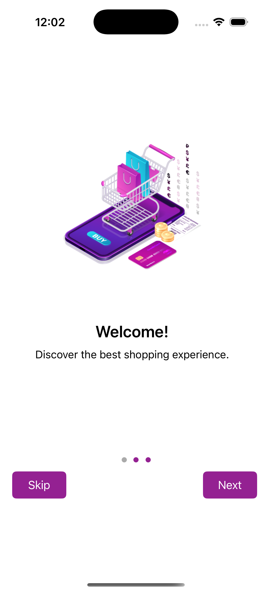
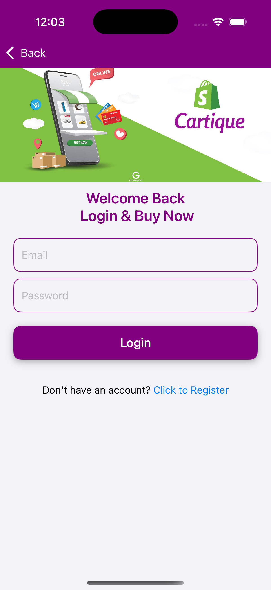
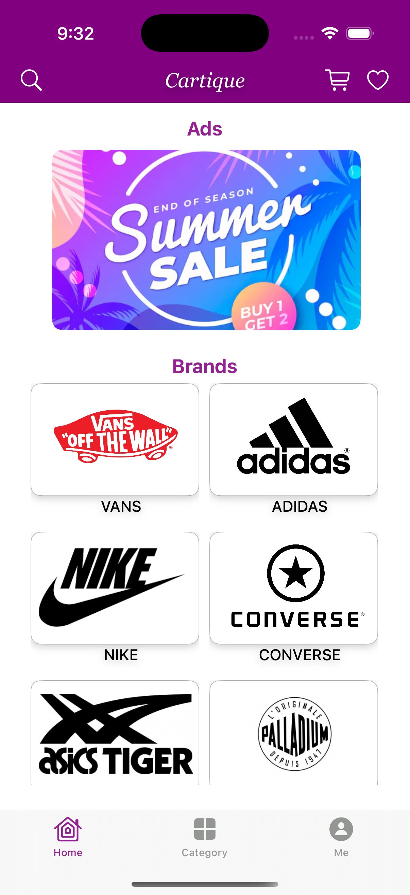
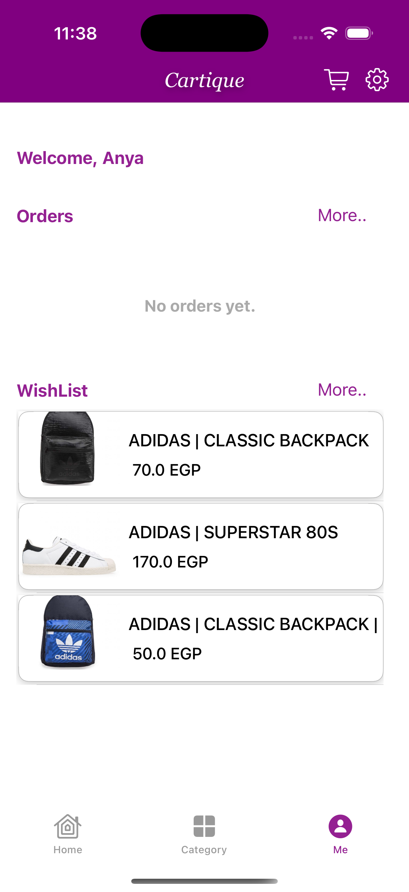
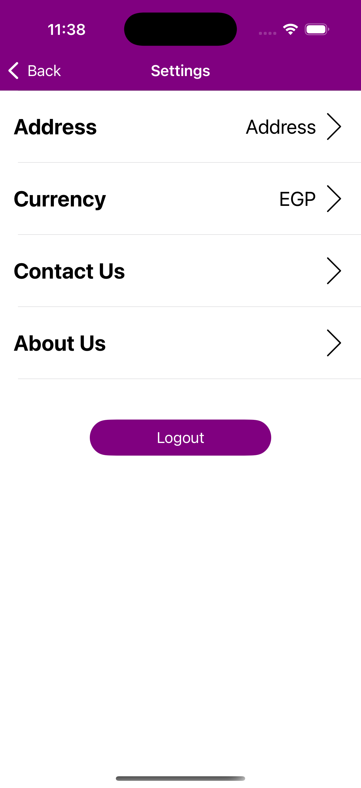

# Cartique M-Commerce iOS App 🛒

A modern M-commerce iOS application developed in Swift as part of the ITI Graduation Project. Cartique integrates Shopify API with Firebase for a seamless shopping experience, including multi-payment support and wishlist functionality.

> Note: This repository does not contain the original source code. The main codebase is hosted on another repository where I contributed to the development.

## Related Repository

You can find the original project code [here](https://github.com/Senpai1112/M-Commerce-App)

## 📱 Features

- Shopify GraphQL API integration for real-time product data
- Firebase Authentication for secure login/signup
- Add to Wishlist functionality using Core Data
- Multi-payment support (Cash/Card) with integrating Apple Pay
- Category browsing and product filtering
- Smooth and responsive UI design

## 🧑‍💻 My Role

As part of a team, I contributed to:

- Building major UI screens using Swift and UIKit
- Integrating Firebase authentication
- Handling GraphQL queries for product and category data
- Implementing the wishlist feature
- Handle Search in Brands, Products and Categories
- Coordinating with teammates using Git and version control best practices

## 🛠️ Tech Stack

- **Language:** Swift
- **Frameworks:**  UIKit
- **Backend Services:** Firebase, Shopify (GraphQL API)
- **Database:** Core Data 
- **Architecture:** MVVM

## 📸 Screenshots

| Greeting | LogIn | Home |
|-------------|------------|------------------|
|  |  |  |

| Setting | Profile | WishList |
|----------------|-------------|------------------|
|  |  |  |

## 🎬 App Demo

[▶️ Watch Demo on Google Drive](https://drive.google.com/file/d/1dxZnx6rFvGjHOuXpXAtAilrCLCt3cDuv/view?usp=drive_link)

